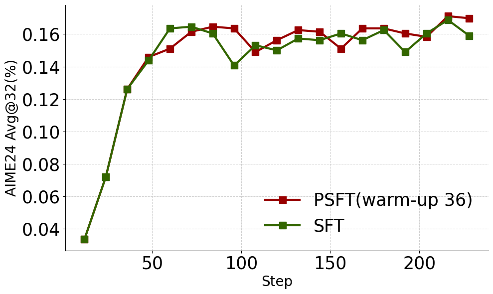

<div align="center">
<h1>Proximal Supervised Fine-Tuning
</h1>


[ <u>Paper</u>](https://arxiv.org/abs/2508.17784) |
[ <u>Code</u>](https://github.com/zwhong714/PSFT) |
[ <u>Model</u>](https://huggingface.co/collections/wh-zhu/psft-68afb02eb237149f9bd9075e)


</div>

# 📖 Overview
Inspired by trust-region policy optimization (TRPO) and proximal policy optimization (PPO) in reinforcement learning (RL), we propose Proximal SFT (PSFT). This fine-tuning objective incorporates the benefits of trust-region, effectively constraining policy drift during SFT while maintaining competitive tuning. By viewing SFT as a special case of policy gradient methods with constant positive advantages, we derive PSFT that stabilizes optimization and leads to generalization, while leaving room for further optimization in subsequent post-training stages.


The left figure presents PSFT applied to Qwen2.5-7B-Instruct, whereas the right corresponds to Llama3.1-8B-Instruct.

## 1. No entropy collapse
<p align="center">
  
  
</p>

## 2. Superior Performance

<p align="center">
  
  
</p>


## 3. Generalization

<p align="center">
  
  
</p>

## 4. A promising start point for RL 

<p align="center">
  
  
</p>


**For a more detailed and comprehensive evaluation, please refer to our paper.**


# 🧸 A Toy Example

We apply both SFT and PSFT on **Qwen2.5-7B-Instruct** using the **LIMO** dataset.

<p align="center">
  
  
</p>

We select the best in-domain checkpoint (216 steps, 18 epochs) and evaluate it on multiple benchmarks. Evaluation is reported with **Avg\@32**, while generation is conducted at **32k** context length.

| Qwen2.5-7B-Instruct | AIME-24   | AIME-25   | AMC       |
| ------------------- | --------- | --------- | --------- |
| SFT                 | 14.69     | 15.42     | 56.64     |
| PSFT                | **15.94** | **18.13** | **58.05** |

| Qwen2.5-7B-Instruct | GPQA      | MMLU-Pro  |
| ------------------- | --------- | --------- |
| SFT                 | 35.80     | 46.50     |
| PSFT                | **38.89** | **51.28** |

**Conclusion.** PSFT consistently outperforms standard SFT across both in-domain and out-of-domain benchmarks. Importantly, it maintains stable entropy throughout training—whereas standard SFT rapidly collapses to near-zero entropy after ~150 steps—thereby preserving diversity in generation and providing a stronger foundation for subsequent RL-based optimization.


# ⚒️ Installation

torch2.6.0+cu124+vllm0.8.5

```
git clone https://github.com/zwhong714/PSFT
cd PSFT

conda create -n psft python==3.10
conda activate psft
cd verl
pip install --no-deps -e .
```

# 🚀 Quick Start

## Prepare Train Data

`python ./prepare_data.py`

You can modify this file to support your PSFT dataset, ensuring that the key `demonstration` is retained in the parquet.


## Training

We provide the implementation within the verl framework; see `PSFT/verl/recipe/psft`.

## Evaluation

```
cd evaluation
serve run eval.llm:build_app model=aaa/bbb/ccc tensor-parallel-size=1

# open another terminal
python eval/eval.py --temperature 0.7 --top_p 0.95 --max_tokens 10240 --model ccc --test_file eval/data/aime-2024.parquet
```
